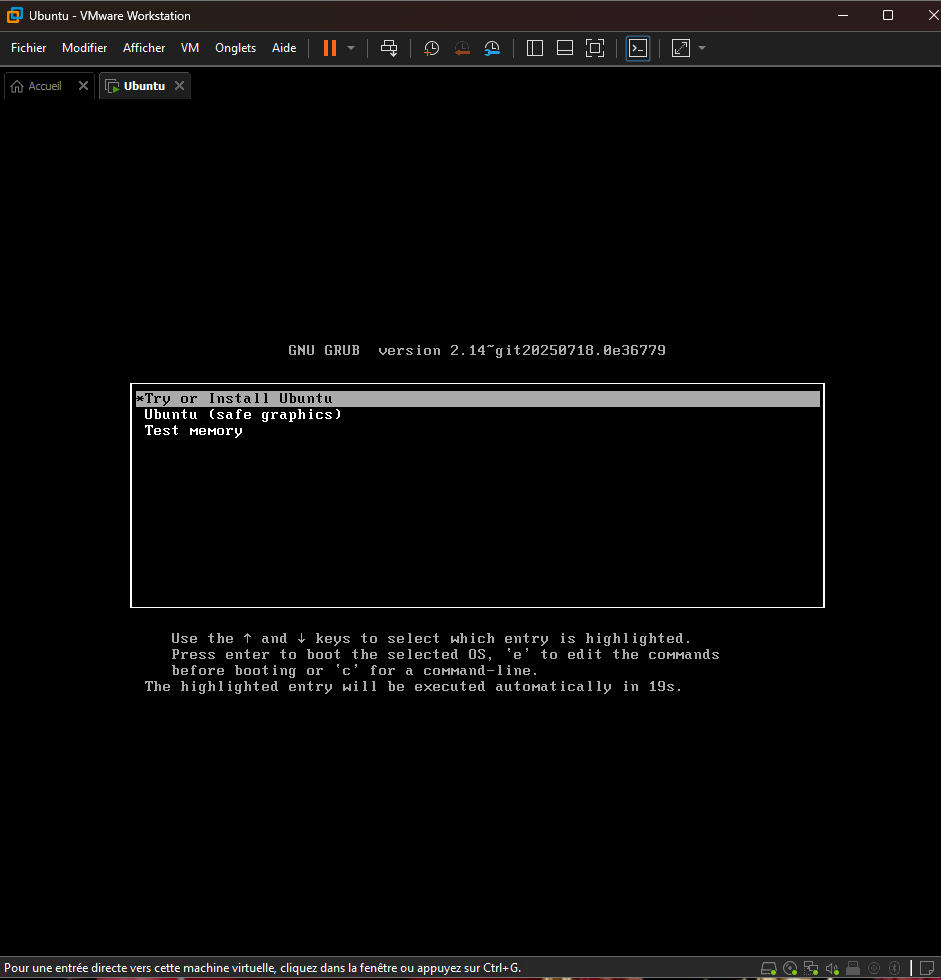
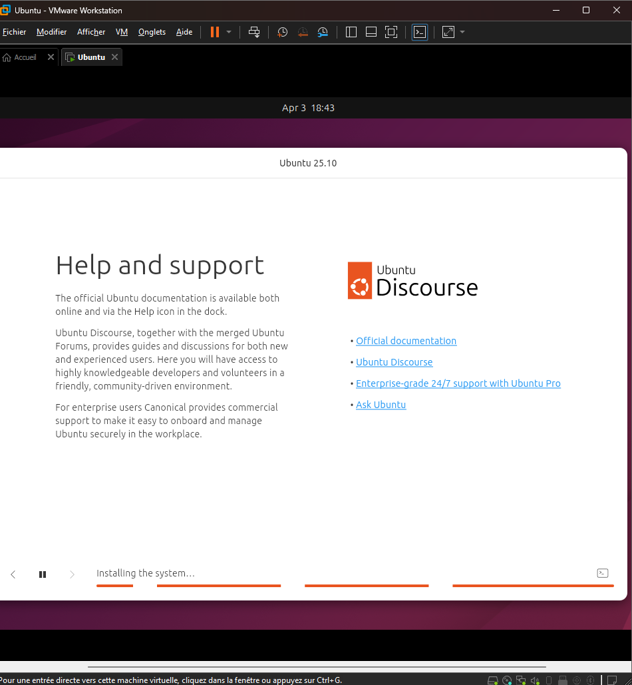
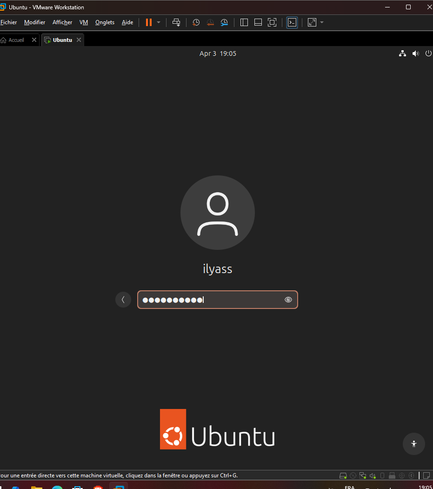
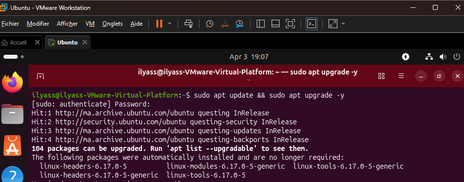
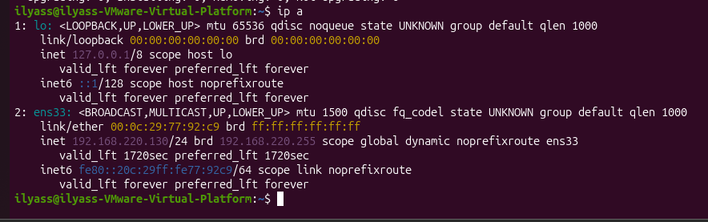
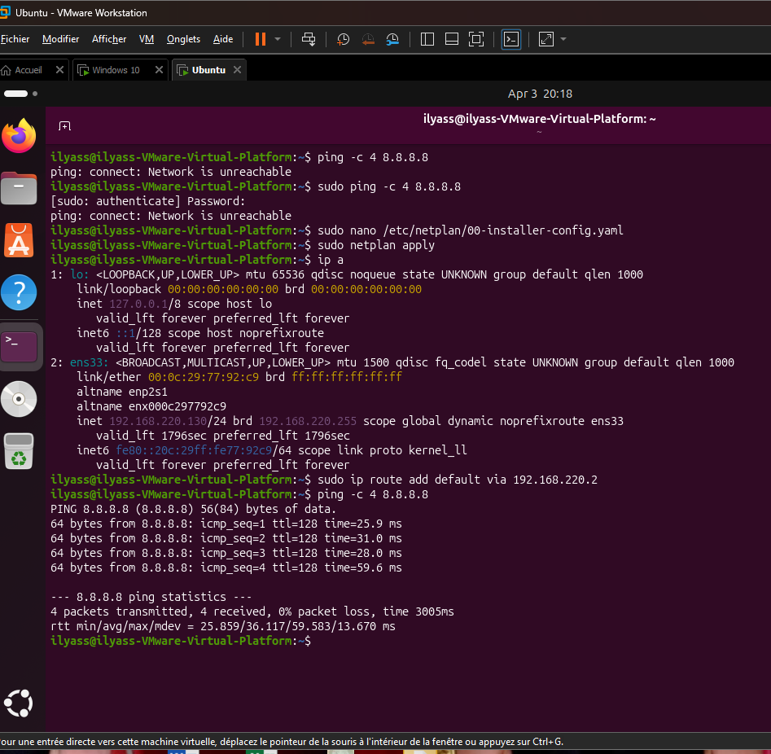
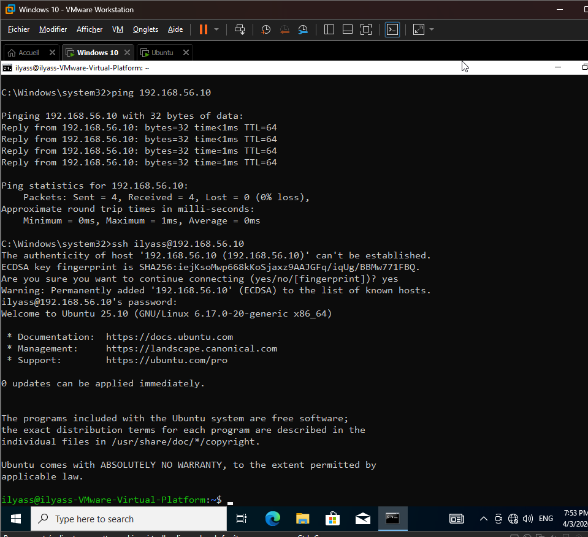
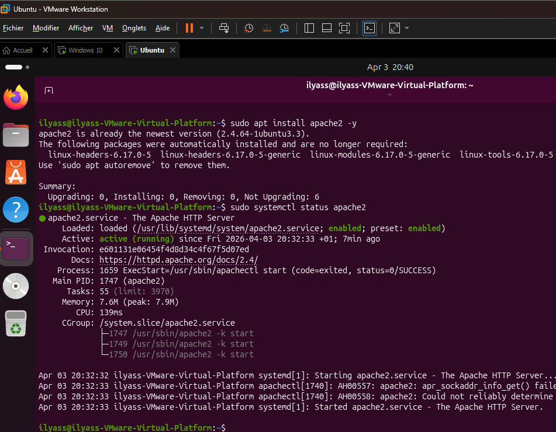
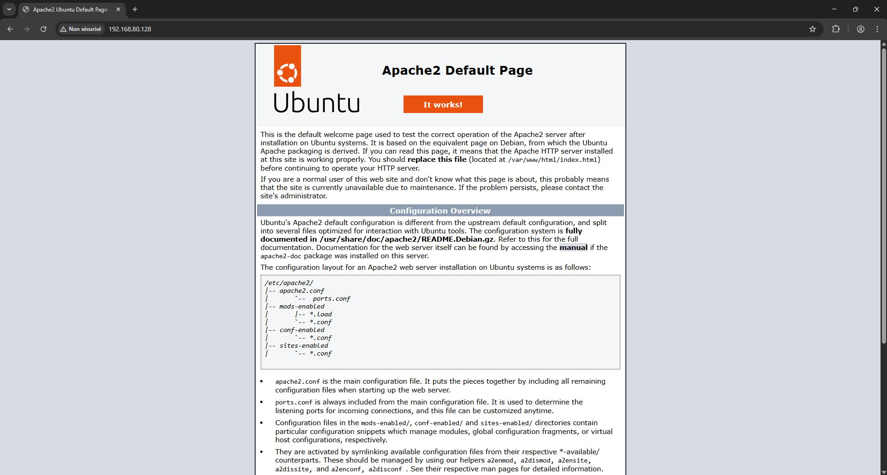

# 🐧 Linux Server Lab (Ubuntu Server Deployment & Administration)

## 📌 Project Overview

This project simulates a real-world Linux server deployment in an enterprise environment using Ubuntu Server.

It covers system installation, initial configuration, network verification, secure remote access (SSH), and web service deployment using Apache.

---

## 🧱 Lab Architecture

* **Server:** Ubuntu Server 22.04
* **Client:** Windows 10 (SSH access)
* **Environment:** VMware Workstation

---

## ⚙️ Technologies & Tools

* Ubuntu Server
* Linux CLI (Terminal)
* OpenSSH
* Apache Web Server
* VMware Workstation

---

## 🎯 Key Objectives

* Deploy a Linux server environment
* Configure system and networking
* Enable secure remote access (SSH)
* Install and test a web server

---

## 🎯 What I Did

* Installed Ubuntu Server on a virtual machine
* Configured system environment and networking
* Verified IP address and connectivity
* Enabled SSH for remote administration
* Installed and configured Apache web server
* Tested web service from client machine

---

# 🔹 Part 1: Installation & Setup

### 🖥️ Screen 1: VMware Setup

Creation of the virtual machine and loading Ubuntu Server ISO.

### 🖥️ Screen 2: Ubuntu Server Installation

Installation of Ubuntu Server inside the virtual environment.

---

# 🔹 Part 2: Initial Configuration

### 🖥️ Screen 3: First Login

Accessing the system using configured credentials.

### 🖥️ Screen 4: System Update

Updating system packages using apt.

### 🖥️ Screen 5: IP Address Check

Verifying assigned IP address.

### 🖥️ Screen 6: Internet Connectivity

Testing connectivity using ping.

---

# 🔹 Part 3: Remote Access (SSH)

### 🖥️ Screen 7: SSH Connection

Successful SSH connection from Windows to Linux server.

---

# 🔹 Part 4: Web Server Deployment (Apache)

### 🖥️ Screen 8: Apache Installation

Installing Apache web server.

### 🖥️ Screen 9: Web Server Test

Accessing web server via browser.

---

## ✅ Key Achievements

* Successfully deployed a Linux server environment
* Configured system updates and networking
* Enabled secure SSH remote access
* Deployed and tested Apache web server

---

## 🛠️ Skills Demonstrated

* Linux System Administration
* SSH Remote Management
* Network Configuration & Troubleshooting
* Web Server Deployment (Apache)
* Virtualization (VMware)

---

## 📌 Conclusion

This project demonstrates a complete Linux server deployment workflow, from installation to service configuration.

It reflects practical skills in system administration, networking, and server management in a real-world scenario.
